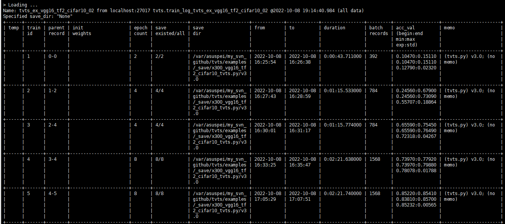
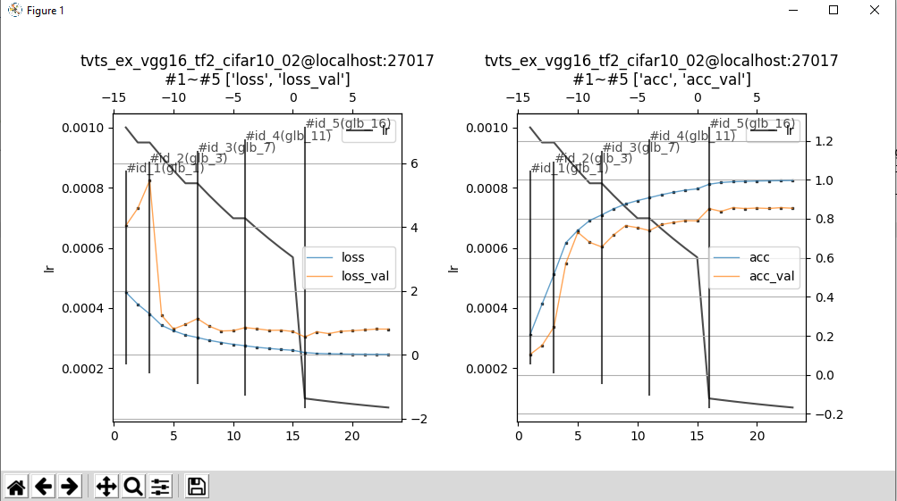
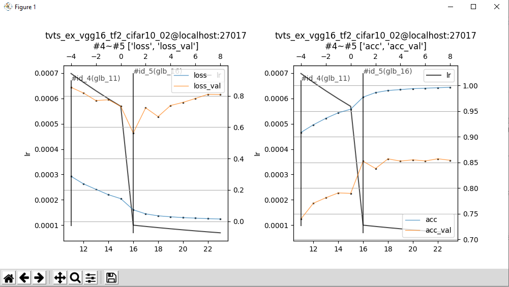
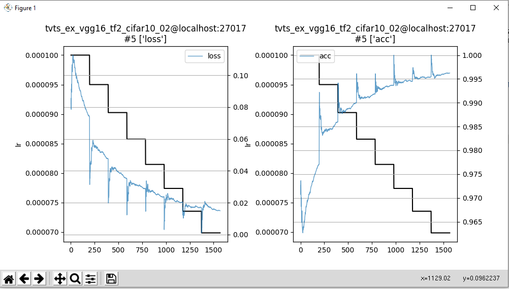
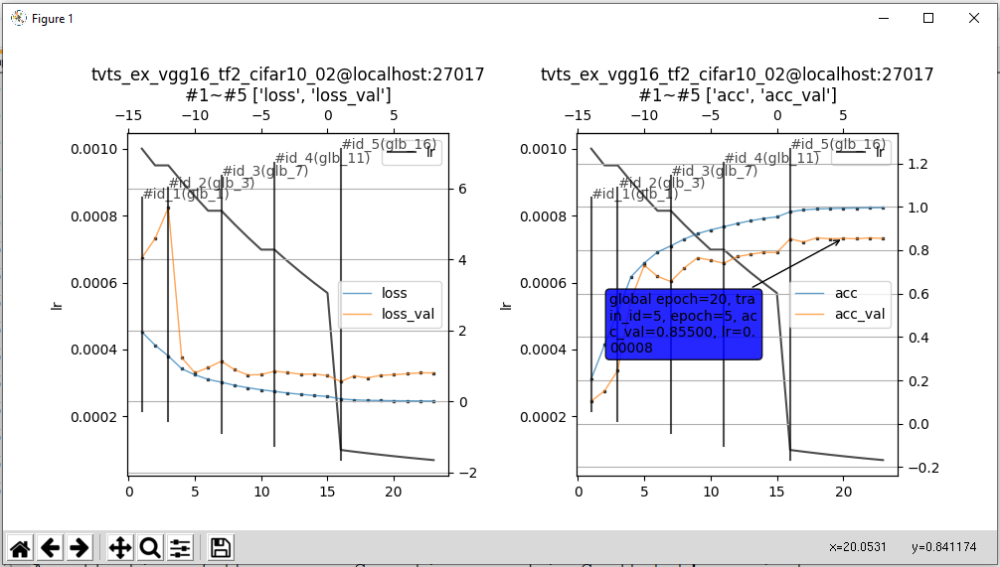

# Table of contents

 - [A brief intro to TVTS](#a-brief-intro-to-tvts)

 - [Why TVTS when there is a TensorBoard?](#why-tvts-when-there-is-a-tensorboard)

 - [Prerequisites](#prerequisites)

    - [Other prerequisites of the code](#other-prerequisites-of-the-code)

 - [Installation](#installation)

   1. [Clone the code](#1-clone-the-code)

   2. [Add to the user's project](#2-add-to-the-users-project)

   3. [Use them](#3-use-them)

 - [Organization of the code](#organization-of-the-code)

 - [Conceptions](#conceptions)

 - [Use the code to record information about the training](#use-the-code-to-record-information-about-the-training)

   1. [Instantiate a TVTS object](#1-instantiate-a-tvts-object)

   2. [Resume from former training checkpoint](#2-resume-from-former-training-checkpoint)

   3. [Record information about each batch](#3-record-information-about-each-batch)

   4. [Record information about each epoch](#4-record-information-about-each-epoch)

   5. [The reserved keywords](#5-the-reserved-keywords)

 - [The example code](#the-example-code)

   1. [The simplest fake example](#1-the-simplest-fake-example)

   2. [The fake example simulates the real practice](#2-the-fake-example-simulates-the-real-practice)

       - [Specify Parent Train ID and Parent Epoch ID](#specify-parent-train-id-and-parent-epoch-id)

       - [The recommended "temporary" testing process in practice](#the-recommended-temporary-testing-process-in-practice)

       - [About the saved weights/models](#about-the-saved-weightsmodels)

   3. [Use TVTS with TensorFlow](#3-use-tvts-with-tensorflow)

   4. [Use TVTS with Pytorch](#4-use-tvts-with-pytorch)

 - [How to visualize the user's recorded information](#how-to-visualize-the-users-recorded-information)

    - [Exploit the feature provided by PyQt backend matplotlib](#exploit-the-feature-provided-by-pyqt-backend-matplotlib)

    - [Hover over the curves](#hover-over-the-curves)

 - [Use TVTS in C/C++](#use-tvts-in-cc)

 - [About the future of TVTS](#about-the-future-of-tvts)

 - [About the author](#about-the-author)

# A brief intro to TVTS

[TVTS](https://github.com/cmpltrtok20/tvts) (**Trackable and Visible Training System**) is an auxiliary system for machine learning or deep learning model training written in Python3, with [MongoDB](https://www.mongodb.com/) as its storage backend and [Matplotlib](https://matplotlib.org/) as its visualization backend.

The user could also use TVTS in C/C++ by [libtvtsc](https://github.com/cmpltrtok20/libtvtsc) ( Also a project of mine. )

Currently, **only Linux platforms** are considered. Maybe the user could run it on other Unix-like platforms, but it is not tested.

# Why TVTS when there is a TensorBoard?

Yes, almost the entire TVTS is simulating the scalar recording and visualization features of TensorBoard. But:

1, TVTS can handle it but TensorBoard cannot do it so friendly toward developers as TVTS does, that the user runs the model training more than once, and the user uses a checkpoint that is not the final one of a former training.

2, In the above situation, even if the user just uses the final checkpoints of former pieces of training, it is tricky for TensorBoard to merge the visualization of recordings of the related training processes.

3, TensorBoard is not as easy to customize as TVTS. ( At least the author feels so. TVTS is plain python code; so the user can edit it easily as she wishes.)

4, Other considerations. Such as that the author feels happy to implement such a utility.

# Prerequisites

- Of course, first of all, the user must have an accessible [MongoDB](https://www.mongodb.com/).

## Other prerequisites of the code

- [numpy](https://numpy.org/install/)

- [pymongo](https://pypi.org/project/pymongo/)

- [matplotlib](https://matplotlib.org/stable/users/installing/index.html)

- [texttable](https://pypi.org/project/texttable/)

- [PyCmpltrtok](https://github.com/cmpltrtok20/PyCmpltrtok) ( Also a project of mine. )

# Installation

## 1, Clone the code

```bash
$ mkdir tvts
$ git clone https://github.com/cmpltrtok20/tvts.git tvts
```

## 2, Add to the user's project

They are just normal python3 codes.

For instance, the user could use them as below:

**(Make sure the /python/project/root/dir is in the environment variable PYTHONPATH.)**

```bash
$ cd /python/project/root/dir
$ ln -sfn /path/to/where/tvts/is/cloned tvts
```

## 3, Use them

Then use them in the user's python3 project as below:

```python
import tvts.tvts as tvts
```

Now **"tvts"** represents tvts.py and **"tvts.Tvts"** is the TVTS class.

# Organization of the code

```
tvts
├── examples
│   ├── _save ( A dir generated by the code, the user must have privileges to generate it and to
│   │       write files into it. )
│   ├── x100_fake_demo_simple.py ( A simple fake demo )
│   ├── x200_fake_demo_simulating_practice.py ( A complex fake demo simulating practice )
│   ├── x300_vgg16_tf2_cifar10_tvts.py ( Example with Tensorflow 2.x simulating practice )
│   └── x400_vgg16_torch_cifar10_tvts.py ( Example with PyTorch simulating practice )
├── README.md
└── tvts.py ( The core code. Class Tvts for value recording, and main code of this file for visualization. )
```

Note:

 - tvts/examples/_save

This is a directory generated by running the code with the default save_dir option, the user must have privileges to generate it and to write files into it.

# Conceptions

 - **Train ID** and **Name**

If the user adopts TVTS, the user establishes an object of TVTS with a property named "Name" at the beginning of the user's training and the user records data during this training process by that object. And the user could repeat this process to train a model by several pieces of training with relationships between these pieces of training or not. Data recordings of all the pieces of training with the same "Name" will be collected together; each training has a "Training ID" (auto-increment from one).

 - **Epoch ID**

TVTS does not force the semantic of "epoch" and only implies that after each "epoch" the user should invoke TVTS to record data that is of interest. "Epoch ID"s are auto-increments from one during a certain training and all "Epoch ID"s associate with the same "Train ID".

 - **Parent Train ID**, **Parent Epoch ID**, and **Parent Epoch**

All the pieces of training with the same "Name" can be merged together and then be visualized, such as the user starts training with saved weights from another training. Then we could say that the current training has a "Parent Train ID" and a "Parent Epoch ID" which means the "Train ID" and the "Epoch ID" of the saved weights. They are the "Parent Train ID" and the "Parent Epoch ID" which let TVTS maintains relationships between several pieces of training and do it better than TensorBoard. When a trainig has no "Parent Train ID", we could say that its "Parent Train ID" is zero (and then the "Parent Epoch ID" has no meaning). When we say "Parent Epoch ID" is zero when the "Parent Train ID" is not zero, that means taking the saved weights from the final saved epoch of the parent training. We assume that a "Parent Epoch" means an epoch with the Epoch ID of Parent Epoch ID in training with the Train ID of Parent Train ID.

# Use the code to record information about the training

## 1, Instantiate a TVTS object

As the example in x200\_fake\_demo\_simulating\_practice.py, we could initialize a TVTS object as follow:

```python
xparams={
    'ver': VER,
    'batch_size': N_BATCH_SIZE,
    'lr': LR,
    'gamma': GAMMA,
    'n_epoch': N_EPOCHS,
}
ts = tvts.Tvts(
    NAME,
    memo=MEMO,
    is_temp=TEMP,
    host=MONGODB_HOST, port=MONGODB_PORT,
    save_freq=SAVE_FREQ, save_dir=SAVE_DIR,
    init_weights=INIT_WEIGHTS,
    params=xparams
)
```

## 2, Resume from former training checkpoint

As the example in x200\_fake\_demo\_simulating\_practice.py, we could resume from a former training as follow:

```python
rel_path, _ = ts.resume(PARENT_TRAIN_ID, PARENT_EPOCH, keys_of_data_to_restore=['lr', 'gamma'])
```

Note: To resume training with PARENT\_TRAIN\_ID and PARENT\_EPOCH means the user linked the 2 pieces of training together by setting the PARENT\_TRAIN\_ID and PARENT\_EPOCH of the current training represented by this TVTS object, and the user obtained the relative path and the save_dir of the saved weights of the parent epoch.

If it is the initial training, i.e. not based on a former training, the user could just not invoke the method "resume" or invoke it with PARENT_TRAIN_ID = 0.

This only linked the 2 training when doing visualization, and it is the user's own burden to load the saved weights from the Parent Epoch before this turn of training represented by this TVTS object.

The user could also specify keys\_of\_data\_to\_restore when invoking "resume", then data of these keys in the former recording will override the data in the current TVTS object. It is the user's own burden to copy them from the TVTS object to the current training, as below:

```
if not IS_SPEC_LR:
    LR = ts.params['lr']
if not IS_SPEC_GAMMA:
    GAMMA = ts.params['gamma']
```

## 3, Record information about each batch

As the example in x200\_fake\_demo\_simulating\_practice.py, we could record the data of each batch as below:

```python
ts.save_batch(epoch, batch, {
    'lr': LR,
    'gamma': GAMMA,
    'loss': LOSS,
    'top1': TOP1,
    'loss_val': LOSS_VAL,
    'top1_val': TOP1_VAL,
})

```

Note: Many people believe the batch information is optional, but the author guesses it is an important clue to make sure the training is normal, i.e. the loss value is decreasing and at the same time the metrics are better and better, although there may be some undulation, the trend should be so.

## 4, Record information about each epoch

As the example in x200\_fake\_demo\_simulating\_practice.py, we could record data of each epoch as below:

```python
# save the last epoch or by ts.save_freq
# Note: Implement the semantic of save_freq and save_rel_path is your burden.
xargs = {}
if epoch == N_EPOCHS or 0 == epoch % ts.save_freq:
    save_prefix = ts.get_save_name(epoch)
    save_rel_path = get_path_from_prefix(save_prefix, '.npy')
    # actually do the saving task
    save_path = os.path.join(ts.save_dir, save_rel_path)
    xsave(save_path, LOSS, TOP1, LOSS_VAL, TOP1_VAL)
    print(f'Saved to: {save_path}')
    xargs = dict(save_rel_path=save_rel_path, save_dir=ts.save_dir)
# Note: use tvts to save info of an epoch
ts.save_epoch(epoch, {
    'lr': LR,
    'gamma': GAMMA,
    'loss': LOSS,
    'top1': TOP1,
    'loss_val': LOSS_VAL,
    'top1_val': TOP1_VAL,
}, **xargs)
```

## 5, The reserved keywords

In the above code examples, there are dictionaries to store, such as

```python
{
    'ver': VER,
    'batch_size': N_BATCH_SIZE,
    'lr': LR,
    'gamma': GAMMA,
    'n_epoch': N_EPOCHS,
}
```

```python
{
    'lr': LR,
    'gamma': GAMMA,
    'loss': LOSS,
    'top1': TOP1,
}
```

```python
{
    'lr': LR,
    'gamma': GAMMA,
    'loss': LOSS,
    'top1': TOP1,
    'loss_val': LOSS_VAL,
    'top1_val': TOP1_VAL,
}
```

Yes, the user may select the keys as her will; but there are some reserved keys, as below:

```python
RESERVED_KEYS = set([
    'batch',
    'datetime',
    'duration_in_sec',
    'epoch',
    'from_datetime',
    'global_batch',
    'init_weights',
    'is_temp',
    'memo',
    'name',
    'parent_epoch',
    'parent_id',
    'save_dir',
    'save_freq',
    'to_datetime',
    'train_id',
])
```

Please do NOT use the reserved keys or the user gets no effect, warnings, or errors.

# The example code

The author recommends the user studies the 4 examples in the order of their prefixes such as x100, x200, x300, and x400.

## 1, The simplest fake example

 - tvts/examples/x100\_fake\_demo\_simple.py

Among the output of this script, the user should pay attention to this as below:

```
Use below CLI command to visualize this training by TVTS:
python3 /path/to/tvts/tvts.py --host 127.0.0.1 --port 27017 -m "loss|loss_val,top1|top1_val" --batch_metrics "loss,top1" -k "top1_val" "tvts_fake_demo_simple"
```

The user should study the CLI options of tvts.py as in [How to visualize the user's recorded information](#how-to-visulize-the-users-recorded-information). The above prompt is just a handy reference and the user must write their own based on the understanding of the CLI options of tvts.py in real practice.

## 2, The fake example simulates the real practice

 - tvts/examples/x200\_fake\_demo\_samulating\_practice.py

The user may obtain the CLI options as below:

```
$ python3 x200_fake_demo_samulating_practice.py --help
--------------------------------A fake demo of TVTS simulating real practice--------------------------------
--------------------------------Decide hyper params--------------------------------
Default LR=0.001, GAMMA=0.95
usage: x200_fake_demo_samulating_practice.py [-h] [--name NAME] [--memo MEMO]
                                             [--temp] [-n EPOCHS]
                                             [--batch BATCH] [--lr LR]
                                             [--gamma GAMMA] [--pi PI]
                                             [--pe PE] [--save_freq SAVE_FREQ]
                                             [--save_dir SAVE_DIR]
                                             [--init_weights INIT_WEIGHTS]
                                             [--host HOST] [--port PORT]

optional arguments:
  -h, --help            show this help message and exit
  --name NAME           The name of this training, VERY important to TVTS.
                        (default: tvts_py_example_x200_01)
  --memo MEMO           The memo. (default: (no memo))
  --temp                Run as temporary code (default: False)
  -n EPOCHS, --epochs EPOCHS
                        How many epoches to train. (default: 10)
  --batch BATCH         Batch size. (default: 256)
  --lr LR               Learning rate. (default: None)
  --gamma GAMMA         Multiplicative factor of learning rate decay per
                        epoch. (default: None)
  --pi PI               id of the parent training (default: 0)
  --pe PE               parent epoch of the parent training (default: 0)
  --save_freq SAVE_FREQ
                        How many epochs save weights once. (default: 2)
  --save_dir SAVE_DIR   The dir where weights saved. (default: /var/asuspei/my
                        _svn_github/tvts/examples/_save/x200_fake_demo_samulat
                        ing_practice.py/v1.0)
  --init_weights INIT_WEIGHTS
                        The path to the stored weights to init the model.
                        (default: None)
  --host HOST           Host of the mongodb for tvts. (default: localhost)
  --port PORT           Port of the mongodb for tvts. (default: 27017)
$
```

The prompt on how to use tvts.py to visualize the data is similar to x100\_fake\_demo\_simple.py.

The code seems to be a bit long, but they are all necessary for real practice. Such as how to resume from a former training, how to specify init_weights, how to remember the learning rate and the related Gamma value to let it declines, how to implement the semantic of "temporary training", etc.

### Specify Parent Train ID and Parent Epoch ID

The user could specify Parent Train ID and Parent Epoch ID via the CLI option --pi and --pe.

### The recommended "temporary" testing process in practice

Run it by small data to ensure the code is right.

From example x200 to x400, the option "--temp" has a semantic that only 1024 samples participated in the training when the formal training will use 50k samples. The user may not feel the difference of training time between 1024 and 50k in this fake example, but it is significant in real practices and the following 2 examples, i.e. x300\_vgg16\_tf2\_cifar10\_tvts.py and x400\_vgg16\_torch\_cifar10\_tvts.py.

### 

### About the saved weights/models

Considering that the user may move stored weights/models to other directories, and the user may only provide a relative base directory and run the program at another directory, in TVTS saved weights/models are represented in 2 parts: (1) save\_dir and (2) save\_rel\_path.

When the user initializes the TVTS object, they could provide the save_dir or the program will take it to be the current working directory.

When the user uses the tvts.py to visualize their recorded data, as in the section [How to visualize the user's recorded information](#how-to-visulize-the-users-recorded-information), there is a column named "save existed / all" to tell the user how many weights/models are recorded as "saved" and how many saved paths are "existed". It is just information for the user, and when the user running the visualization program on another machine, the existing count may always be zero, and when the saved weights/models are moved or the current working directory impacted the statistics, the user may provide the right save_dir to the visualization program by --save\_dir command line option.

Note: the author does not distinguish between saved weights and saved models, and calls them all "saved weights". So does the reserved keyword "init_weights".

## 3, Use TVTS with TensorFlow

 - tvts/examples/x300\_vgg16\_tf2\_cifar10\_tvts.py

The CLI options and the --help option is similar to x200\_fake\_demo\_samulating\_practice.py.

The prompt on how to use tvts.py to visualize the data is similar to x100\_fake\_demo\_simple.py. Because when TensorFlow 2 starts the training, it may be very hard for the user to scroll up their CLI to check The prompt on how to use tvts.py, so please firstly run as temporary code by add "--temp" to the command to get The prompt on how to use tvts.py.

The user may discover that when using TVTS with TensorFlow 2 keras, she may invoke TVTS at callbacks as in the example code.

And the author generated the data used in the section [How to visualize the user's recorded information](#how-to-visulize-the-users-recorded-information) by the below commands:

```
$ python3 x300_vgg16_tf2_cifar10_tvts.py --name "tvts_ex_vgg16_tf2_cifar10_02"
$ python3 x300_vgg16_tf2_cifar10_tvts.py --name "tvts_ex_vgg16_tf2_cifar10_02" -n 4 --pi 1
$ python3 x300_vgg16_tf2_cifar10_tvts.py --name "tvts_ex_vgg16_tf2_cifar10_02" -n 4 --pi 2
$ python3 x300_vgg16_tf2_cifar10_tvts.py --name "tvts_ex_vgg16_tf2_cifar10_02" -n 8 --pi 3
$ python3 x300_vgg16_tf2_cifar10_tvts.py --name "tvts_ex_vgg16_tf2_cifar10_02" -n 8 --pi 4 --pe 5
```

Note: Although TensorFlow 2 will print a lot of information on stderr, this information is useful such as to judge if the user's GPU is adopted by the framework. The author advice the user to add the code "2> >(while read line; do echo -e "\e[01;31m$line\e[0m" >&2; done)" to the end of the user's command to distinguish stderr and stdout as below. (Note: the command below just run x300\_vgg16\_tf2\_cifar10\_tvts.py temporarily without any special meaning.)

```
$ python3 x300_vgg16_tf2_cifar10_tvts.py --temp
$ python3 x300_vgg16_tf2_cifar10_tvts.py --temp 2> >(while read line; do echo -e "\e[01;31m$line\e[0m" >&2; done)
```

## 4, Use TVTS with Pytorch

 - tvts/examples/x400\_vgg16\_torch\_cifar10\_tvts.py

The CLI options and the --help option is similar to x200\_fake\_demo\_samulating\_practice.py.

The prompt on how to use tvts.py to visualize the data is similar to x100\_fake\_demo\_simple.py.

Actually, this file invoked common PyTorch code in [PyCmpltrtok](https://github.com/cmpltrtok20/PyCmpltrtok/blob/master/common_torch.py) ( also a project of mine ) that contains the usage of TVTS.

# How to visualize the user's recorded information

The user could only run it via CLI at the current version. Running it via CLI on the Linux Desktop environment is straightforward, but running it via PyQt backend matplotlib, SSH and local X11 servers may let the user make several Googling to solve it. The author is sorry for this inconvenience.

After the user correctly set the environment variable DISPLAY and the X11 server, she could run tvts.py to visualize the recorded data.

Note: Please use the below command to check the options of tvts.py:

```
$ python3 /path/to/tvts/tvts.py --help
usage: tvts.py [-h] [--temp TEMP] [--host HOST] [-p PORT] [--db DB]
               [--prefix PREFIX] [--save_dir SAVE_DIR] [--hyper HYPER]
               [-m METRICS] [-k KEYS] [--batch_metrics BATCH_METRICS]
               name

positional arguments:
  name                  name of the training

optional arguments:
  -h, --help            show this help message and exit
  --temp TEMP           if only show data that is temporary or not (0/1/-1)
                        (default: -1)
  --host HOST           host of the mongodb (default: localhost)
  -p PORT, --port PORT  port of the mongodb (default: 27017)
  --db DB               name of the db (default: tvts)
  --prefix PREFIX       prefix of the tables (default: train_log)
  --save_dir SAVE_DIR   save dir of the save_rel_path (default: None)
  --hyper HYPER         the default hyper param to check (default: lr)
  -m METRICS, --metrics METRICS
                        CSV list of default metrics groups, each group is
                        vertical bar separated string (default: loss)
  -k KEYS, --keys KEYS  CSV list of keys that will be shown in the table
                        (default: None)
  --batch_metrics BATCH_METRICS
                        CSV list of default metrics groups for batch, each
                        group is vertical bar separated string (default: cost)
$
```

When the user runs tvts.py as below command and she gets prompts as below:

```
$ python3 ~/my_svn/tvts/tvts.py --host "localhost" --port 27017 -m "loss|loss_val,acc|acc_val" --batch_metrics "loss,acc" -k "acc_val" "tvts_ex_vgg16_tf2_cifar10_02"
> 
Name: tvts_ex_vgg16_tf2_cifar10_02 from localhost:27017 tvts.train_log_tvts_ex_vgg16_tf2_cifar10_02 @2022-10-08 18:55:01.395 (all data)
Specified save_dir: "None"
> Help info:
> Directly press ENTER to show the summary table. Input q/Q/quit to quit.
> Or: Input "m/bm/hyper/keys=value" to change corresponding keys.
> Or: Input "temp=0/1/-1" to show summary table of only temporary data, only formal data, or all data.
> Or: Input "dir=/path/of/dir/of/saved/weights" to specify save_dir.
> Or: Do the plotting by CLI command like: [-s SINCE] [-m METRICS(default: loss|loss_val,acc|acc_val)] [--batch_metrics BATCH_METRICS(default: loss,acc)] [--hyper HYPER=(default: lr)] [-b] [--epoch_range(default: 0:0)] train_id
```

If the user press ENTER to show the summary table, it may look at below:



Note: this table is self-explanatory, the 2nd column from the right is "acc_val" because there is '-k "acc\_val"' in my CLI option. "exp" means expectation, and "std" means standard deviation.

Please pay attention to the 3rd column from the left, titled "parent record", which is the very Parent Train ID and Parent Epoch ID of that training. For example, in the row with Train ID 2, its parent epoch is 1-2, which means the 2nd epoch of the training with ID 1; int the row with Train ID 5, its parent epoch is 4-5, which means the 5th epoch of the training with ID 4.

The user may already discover that the only mandatory option is the train_id. Let us only input "**5**" and press ENTER. The plotting will be as below:

```
5
> Visualizing training with id of 5 with metrics_groups loss|loss_val,acc|acc_val with hyper parameter lr
> Check and close the plotting window to continue ...
```



Note: the first sub-window has the curve of "loss" and "loss\_val" and the second one has "acc" and "acc\_val", because that the CLI options used to invoke the tvts.py includes '-m "loss|loss\_val,acc|acc\_val"'.

The y-axis on the left side is for the hyper, and the y-axis on the right is for the main curve.

As the prompted message, "**Check and close the plotting window to continue**".

The user may discover that the pieces of training with ID 1 ~ 5 are linked by Parent Train ID and Parent Epoch ID so that their visualization is merged into the one as in the screenshot. If the user is only interested in the visualization from training with ID 4, the user can enter "**-s 4 5**" and press ENTER (Just as the prompted instruction). Then the user will get plottings as below:

```
-s 4 5
> Visualizing training with id of 5 from id of 4 with metrics_groups loss|loss_val,acc|acc_val with hyper parameter lr
> Check and close the plotting window to continue ...
```



As the prompted help message says, the user may use "**-b 5**" and ENTER to visualization data of batches of training with ID 5, as below:

```
-b 5
> Visualizing batch records ONLY of training with id of 5 with metrics_groups loss,acc with hyper parameter lr
> Check and close the plotting window to continue ...

```



## Exploit the feature provided by PyQt backend matplotlib

Because the visualization window is just a plain plotting window of matplotlib, the user could zoom, reset, and save the current plotting among other activities by clicking the buttons the matplotlib provided like below:


## Hover over the curves

Hovering over the curves, the user would get information about the point the user pointed at. As below:



# Use TVTS in C/C++

The user could use TVTS in C/C++ via recording data by [libtvtsc](https://github.com/cmpltrtok20/libtvtsc) (also a project of mine) and visualizing them by tvts.py as above.

[libtvtsc](https://github.com/cmpltrtok20/libtvtsc) is just a manual python to C translation.

# About the future of TVTS

 - The author will complete the documentation of the APIs.

 - The author will learn more knowledge about Python's packaging to change these plain Python codes to a real package.

 - The author will try to add TVTS into PyPi, and then we will be able to install it just by "pip install tvts".

 - The author will make some properties of a TVTS object private to avoid users from directly modifying or depending on them in order to decouple the library and the user code.

 - The author will write a libtvtscxx to make it easier to use it in C++ based on the libtvtsc.

# About the author

Hi, my name is [**Yunpeng Pei**](https://github.com/cmpltrtok20), an AI engineer working in the City of Beijing, China. I developed [these projects](https://github.com/cmpltrtok20?tab=repositories) in my spare time just for interest. I will be very happy if you find them to be very little help to the community. I must say sorry that they are far away from perfect and their document is not finished yet, because of my limited ability and limited resources on these projects; although I have tried my best. You could contact me freely by email to my personal email **belarc@163.com**.

